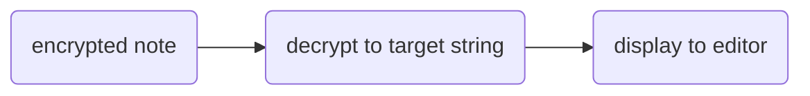

# Notes WASM GO
An experiment project ( part of an InternShip ) to see how far we can push WASM with GO to use it as a note taking app integrated with `git` and encryption logic in wasm to store notes in a secure way to a GitHub repo.

## Runing locally
Running this locally without crazy scripts requires 3 terminals
- Terminal 1: for building wasm file
- Terminal 2: for running the frontend server
- Terminal 3: for running the backend proxy server ( to avoid CORS issues )

### Terminal 1
> requires [go >1.16](https://go.dev/doc/install)

Backend has a script to build the wasm file and copy it to the frontend folder

```bash
cd backend
bash build.sh
```

### Terminal 2
> requires [node >14](https://nodejs.org/en/download/)

#### Add configuration
Create a `.env` file in the frontend folder and add the following
- `VITE_APP_CLIENT_ID` : GitHub OAuth App Client ID
- `VITE_APP_CLIENT_SECRET` : GitHub OAuth App Client Secret
- `VITE_APP_ENCRYPT_SECRET`: Encryption secret ( used to encrypt notes before sending them to GitHub )

in `frontend/src/repo.json` add json object with the following
| key | value |
|-----|-------|
| `Repo`| GitHub repo name in format: `USER/REPO` |
| `Branch`| GitHub repo branch name |
| `owner` | GitHub repo owner name |

now the final file should look like this
```json
{
  "Repo": "USER/REPO",
  "Branch": "main",
  "owner": "USER"
}
```

#### Run the server
```bash
cd frontend
npm i -g pnpm
pnpm i
pnpm run dev
```

This will start up the frontend server on a specific port (usually 5173). navigate to your address [localhost:5173](http://localhost:5173)

### Terminal 3
> requires [go >1.16](https://go.dev/doc/install)

```bash
cd proxy
go run main.go
```

## Docs

### frontend
- WASM works in svelte with [glue file](frontend/src/lib/wasm_exec.js)
- `wasm_init` declared in [wasm_utils.ts](frontend/src/lib/wasm-utils.ts) instantiates wasm stream

#### saving note


#### fetching note


### Wasm
The main package provides functionality for a Go program intended to be executed as a WebAssembly module (WASM). It includes features for interacting with the file system, performing Git operations, and encrypting/decrypting text. This technical documentation describes the various components and functions within the main package.

### Imports

The main package imports the following packages:

| Package | Description |
| --- | --- |
| errors | Provides functions for manipulating errors. |
| path/filepath | Implements utility functions to manipulate file paths. |
| strings | Implements utility functions for manipulating strings. |
| syscall/js | Enables interaction between Go code and JavaScript in the browser. |
| time | Provides functionality for measuring and displaying time. |
| crypto/aes | Implements the Advanced Encryption Standard (AES) symmetric-key encryption algorithm. |
| crypto/cipher | Provides interfaces for symmetric encryption and decryption. |
| encoding/hex | Provides functions for encoding and decoding hexadecimal strings. |
| github.com/go-git/go-billy/v5 | Implements an abstraction for file systems. |
| github.com/go-git/go-billy/v5/memfs | Implements an in-memory file system. |
| github.com/go-git/go-git/v5 | Implements Git operations in Go. |
| github.com/go-git/go-git/v5/plumbing/cache | Implements an object cache for Git operations. |
| github.com/go-git/go-git/v5/plumbing/object | Implements object-related functionality for Git operations. |
| github.com/go-git/go-git/v5/plumbing/transport/http | Provides HTTP transport support for Git operations. |
| github.com/go-git/go-git/v5/storage/filesystem | Implements a file system storage backend for Git operations. |


### Variables

`repoLocation` (string): Specifies the location of the Git repository.
`Filesystem` (memfs.Filesystem): Represents an in-memory file system.
Struct

### Functions
- `regiterCallbacks()`: Registers go functions ( type of `js.Func` ) to be called from javascript

### Exposed functions

All exposed function return a javascript function
to prevent deadlocks nested javascript function returns a Promise object for:

1.  **Asynchronous execution**: WebAssembly is designed to execute code asynchronously, which means that it can perform long-running operations without blocking the main thread. By returning a Promise object, the caller can wait for the operation to complete without blocking the main thread.
    
2.  **Error handling**: Promises provide a standardized way to handle errors in asynchronous code. By returning a Promise object, the caller can use the  `catch`  method to handle any errors that occur during the operation.

3.  **Interoperability**: Promises are a standard feature of JavaScript, which means that they can be used by any JavaScript code that interacts with the WebAssembly module. This makes it easier to integrate WebAssembly code with existing JavaScript code.
    
4.  **Chaining**: Promises can be chained together using the  `then`  method, which allows for more complex asynchronous workflows. By returning a Promise object, the caller can chain multiple operations together to create more complex workflows.

#### `git_clone`
```ts
await git_clone(url: string)
```
used to clone a github reposity to memory

|Parameter| Description |
|-|-|
| `url` | url address for GitHub repo |

#### `git_push`

```ts
await git_push(
	url: string,
	accessTocken: string,
	username: string,
	email: string,
	file: string,
	commitMessage: string
)
```
commits `file` path given in paramter and pushes to remote `url`
|Parameter| Description |
|-|-|
|`url`| url address for GitHub repo |
|`accessTocken`| Access tocken with scope `repo` |
|`username` | username for adding author to commit |
| `email` | email for adding author to commit |
| `file` | file path to commit |
| `commitMessage` | to add commit message |

#### `encrypt_text`
```ts
await encrypt_text(
	text: string,
	key : string
)
```
returns an AES encrypted text encoded in hexadecimal for better redabilty
| Parameters | Description |
|-|-|
|`text` | text string to encrypt |
| `key` | A string ( size of `16` or `24` or `32` bit ) which is used as key  for encryption |

#### `decrypt_text`
```ts
await decrypt_text(
	text: string,
	key: string
)
```
return a decrypted string
| Parameters | Description |
|-|-|
|`text` | hexadecimal encoded AES encrypted text |
| `key` | A string ( size of `16` or `24` or `32` bit ) which is used as key  for decryption |

#### `createfile`
```ts
await create_file(
	file: string
)
```
create an empty file inside in-memory file system
| Parameters | Description |
|-|-|
|`file` | file path to create file |

#### `touchNcat`
```ts
await touchNcat(
	file: string,
	content: string
)
```
creates a file to filepath with contents
| Parameters | Description |
|-|-|
| `file` | file path to create file |
| `content` | content to add in file |


### Usage in go

To use the main package, import it into your Go program and execute the main() function. Ensure that the necessary dependencies are properly installed.

> Note: This package is specifically designed to be used as a WebAssembly module and interacts with JavaScript in the browser.

Here is an example usage of the main package:

package main

<details>
<summary> Code  </summary>

```go
import (
	"fmt"
	"syscall/js"
)

// Example function that calls the Go functions from JavaScript
func exampleUsage() {
	// Call the createFile function
	createFile := js.Global().Get("createFile")
	result := createFile.Invoke("file.txt")
	if result.Type() == js.TypeObject && result.Get("constructor").Get("name").String() == "Promise" {
		// Handle the promise asynchronously
		promise := result
		promise.Call("then", js.FuncOf(func(this js.Value, args []js.Value) interface{} {
			// File created successfully
			fmt.Println("File created:", args[0].String())
			return nil
		})).Call("catch", js.FuncOf(func(this js.Value, args []js.Value) interface{} {
			// Error occurred while creating the file
			err := args[0]
			fmt.Println("Error creating file:", err.Get("message").String())
			return nil
		}))
	}

	// Call the ls function
	ls := js.Global().Get("ls")
	result = ls.Invoke("directory")
	if result.Type() == js.TypeObject && result.Get("constructor").Get("name").String() == "Promise" {
		// Handle the promise asynchronously
		promise := result
		promise.Call("then", js.FuncOf(func(this js.Value, args []js.Value) interface{} {
			// Files listed successfully
			filesArray := args[0]
			for i := 0; i < filesArray.Length(); i++ {
				fmt.Println("File:", filesArray.Index(i).String())
			}
			return nil
		})).Call("catch", js.FuncOf(func(this js.Value, args []js.Value) interface{} {
			// Error occurred while listing files
			err := args[0]
			fmt.Println("Error listing files:", err.Get("message").String())
			return nil
		}))
	}

	// Call the git_clone function
	gitClone := js.Global().Get("git_clone")
	result = gitClone.Invoke("https://github.com/user/repo.git")
	if result.Type() == js.TypeObject && result.Get("constructor").Get("name").String() == "Promise" {
		// Handle the promise asynchronously
		promise := result
		promise.Call("then", js.FuncOf(func(this js.Value, args []js.Value) interface{} {
			// Repository cloned successfully
			fmt.Println("Repository cloned:", args[0].String())
			return nil
		})).Call("catch", js.FuncOf(func(this js.Value, args []js.Value) interface{} {
			// Error occurred while cloning the repository
			err := args[0]
			fmt.Println("Error cloning repository:", err.Get("message").String())
			return nil
		}))
	}

	// Call the git_push function
	gitPush := js.Global().Get("git_push")
	result = gitPush.Invoke("https://github.com/user/repo.git", "accessToken", "username", "email", "file.txt", "Commit message")
	if result.Type() == js.TypeObject && result.Get("constructor").Get("name").String() == "Promise" {
		// Handle the promise asynchronously
		promise := result
		promise.Call("then", js.FuncOf(func(this js.Value, args []js.Value) interface{} {
			// Push successful
			fmt.Println("Pushed to repository")
			return nil
		})).Call("catch", js.FuncOf(func(this js.Value, args []js.Value) interface{} {
			// Error occurred while pushing to the repository
			err := args[0]
			fmt.Println("Error pushing to repository:", err.Get("message").String())
			return nil
		}))
	}

	// Call the encrypt_text function
	encryptText := js.Global().Get("encrypt_text")
	result = encryptText.Invoke("plain text", "encryptionKey")
	if result.Type() == js.TypeObject && result.Get("constructor").Get("name").String() == "Promise" {
		// Handle the promise asynchronously
		promise := result
		promise.Call("then", js.FuncOf(func(this js.Value, args []js.Value) interface{} {
			// Text encrypted successfully
			encryptedText := args[0].String()
			fmt.Println("Encrypted text:", encryptedText)
			return nil
		})).Call("catch", js.FuncOf(func(this js.Value, args []js.Value) interface{} {
			// Error occurred while encrypting the text
			err := args[0]
			fmt.Println("Error encrypting text:", err.Get("message").String())
			return nil
		}))
	}

	// Call the decrypt_text function
	decryptText := js.Global().Get("decrypt_text")
	result = decryptText.Invoke("encrypted text", "encryptionKey")
	if result.Type() == js.TypeObject && result.Get("constructor").Get("name").String() == "Promise" {
		// Handle the promise asynchronously
		promise := result
		promise.Call("then", js.FuncOf(func(this js.Value, args []js.Value) interface{} {
			// Text decrypted successfully
			decryptedText := args[0].String()
			fmt.Println("Decrypted text:", decryptedText)
			return nil
		})).Call("catch", js.FuncOf(func(this js.Value, args []js.Value) interface{} {
			// Error occurred while decrypting the text
			err := args[0]
			fmt.Println("Error decrypting text:", err.Get("message").String())
			return nil
		}))
	})
}

func main() {
	// Register Go functions to be called from JavaScript
	registerCallbacks()

	// Example usage
	exampleUsage()

	// Block indefinitely
	select {}
}
```


</details>

In the above example, we import the necessary packages and define an example function exampleUsage() that demonstrates calling the Go functions from JavaScript. The exampleUsage() function showcases the usage of functions such as createFile(), ls(), git_clone(), git_push(), encrypt_text(), and decrypt_text().

The main() function registers the Go functions as callbacks to be called from JavaScript and then calls the exampleUsage() function. Finally, the program blocks indefinitely using the select {} statement to keep the WebAssembly module running.

This example demonstrates the basic usage of the main package for a Go program intended to be executed as a WebAssembly module.
